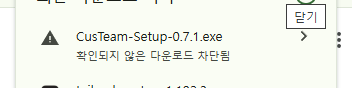
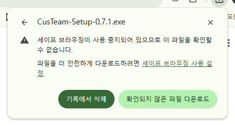
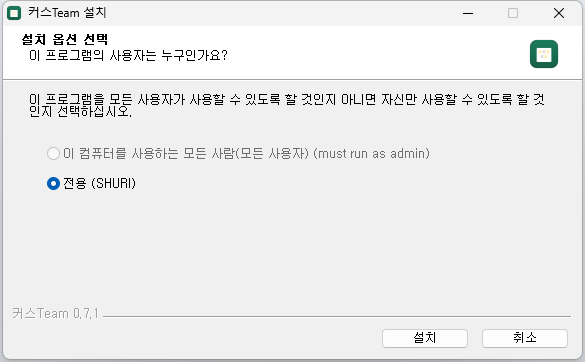
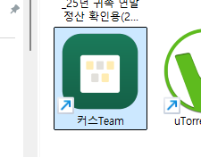
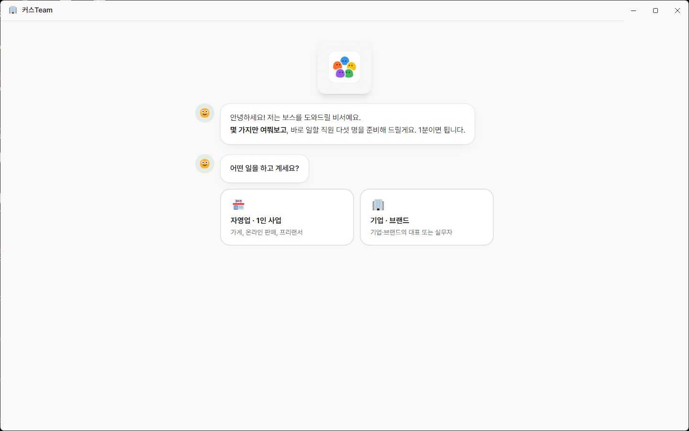
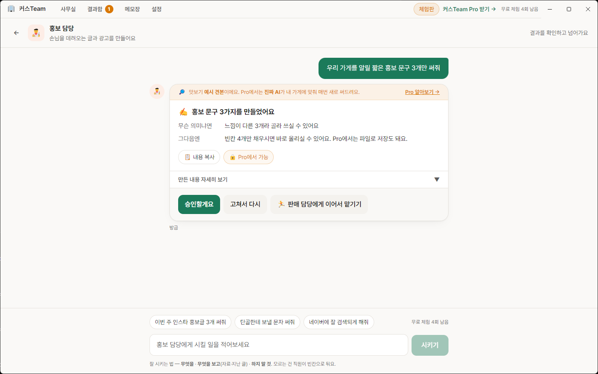
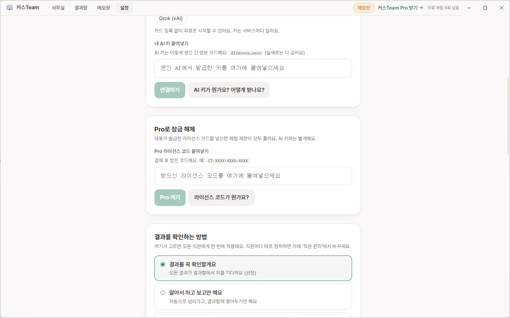
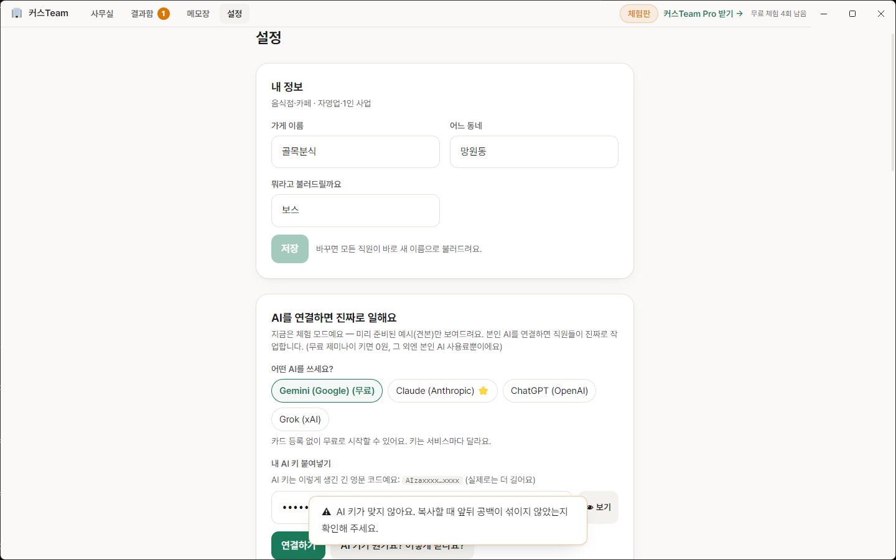

# 커스Team CusTeam

**AI를 처음 쓰는 보스가, 자기 사업에 맞는 AI 직원 다섯 명을 채용해 일을 시키고 결재하는 설치형 프로그램입니다.**

이 저장소는 **설치 파일(Windows)과 자동 업데이트**를 배포하는 곳입니다. 소스코드는 비공개입니다.

## 내려받기

👉 **[최신 설치 파일 받기 (Releases)](https://github.com/dhlee-pixel-hanealal/custeam/releases/latest)**

| 파일 | 용도 |
|---|---|
| `CusTeam-Setup-x.x.x.exe` | 설치 파일. **이것 하나면 됩니다.** 처음엔 무료 체험(견본 5회), Pro 코드를 넣으면 같은 프로그램이 그대로 Pro |
| `custeam-trial-x.x.x.zip` | 위 설치 파일 + 시작하기 안내문 + 사용 조건(LICENSE) 묶음 |
| `latest.yml`, `.blockmap` | 앱의 자동 업데이트용. 직접 받을 필요 없음 |

이 안내는 **Windows 10/11 기준**입니다. 맥·리눅스용은 아직 없습니다.
구매·문의: [litt.ly/custeam](https://litt.ly/custeam) · 카카오톡 채널 "커스팀"

---

## 1단계. 설치 (2분)

1. 받은 `CusTeam-Setup-x.x.x.exe` 를 더블클릭합니다. (zip으로 받았다면 압축을 풀고 그 안의 exe)
   - **Chrome이 다운로드를 막았다면**: 오른쪽 위 다운로드 아이콘 → 그 파일 → **세부정보 더보기 → 확인되지 않은 파일 다운로드**(또는 **보관**)를 누르면 받아집니다.
     아직 코드 서명을 하지 않아 새 파일로 취급돼 뜨는 경고예요.

      
2. "Windows의 PC 보호" 경고가 뜨면 **추가 정보 → 실행**을 누르세요.
   (같은 이유로 뜨는 경고입니다. 앱은 안전합니다.)
3. **"이 프로그램의 사용자는 누구인가요?"** 화면에서 **전용 (내 이름)** 을 고르고 **다음 >**.
   관리자 비밀번호는 필요 없고, 설치 위치는 묻지 않아요.

   
4. 20초쯤 뒤 설치가 끝나면 **실행하기**가 체크된 채로 **마침**. 바탕화면에 [커스Team] 아이콘이 생깁니다.

   

## 2단계. 실행 (1분 인터뷰)

앱을 처음 열면 카카오톡 말풍선처럼 질문이 나와요. **가게 이름 빼고는 전부 버튼만 누르면 됩니다.**

- 어떤 일을 하고 계세요? → 자영업 / 기업
- 어떤 업종이세요? → 11개 중 하나
- 손이 많이 가는 일은? → 여러 개 골라도 돼요 → **다음**
- 직원들 말투는? → 편한 존댓말(권장) 그대로 **다음**
- 가게 이름 · 동네 · 쓰는 AI → 이름만 적고 **직원 다섯 명 데려오기**
  (AI는 "Gemini — 무료로 시작"이 기본. 지금 아무것도 연결하지 않아도 돼요)

끝나면 **직원 5명(기획·홍보·조사·판매·자동화 담당)이 자동으로 배치**됩니다. 열쇠도 결제도 없이 바로 체험(견본 5회)이 돼요.



## 3단계. 첫 작업 (10초)

1. 사무실 화면 아래쪽에 **"첫 일감을 골라뒀어요"** 카드가 있어요. **[지금 시켜보기]** 를 누르세요.
   (직접 고르고 싶으면 화면을 내려 직원 카드를 누르고 예시 버튼 중 하나를 누르면 됩니다. 창을 최대화하면 스크롤 없이 다 보여요.)
2. 몇 초 뒤 결과 카드가 도착합니다. 직원 카드와 결과함에서 진행 상황이 항상 보여요.
   체험판 결과는 **예시 견본**이에요. 진짜 AI가 내 가게에 맞춰 새로 쓰는 건 Pro + 본인 AI 연결 뒤부터입니다.
3. 결과 카드에서 **[승인할게요]** 하거나, **[고쳐서 다시]** 를 누르고 한 줄만 적으세요.
   적은 사유는 그 직원의 **수첩에 쌓여서, 다음부터는 말 안 해도 반영**돼요.
   마음에 든 결과는 **[⭐ 단골 일로 저장]** — 다음부터는 직원 방의 ⭐칩 한 번으로 같은 일을 시켜요.
4. 첫 일감을 한 번 시킨 뒤에는 그 카드 자리에 **접수창**이 생겨요. 지시만 적어도 알맞은 담당에게 자동으로 갑니다.



> **체험 5회**는 "시키기"와 "고쳐서 다시"를 합쳐서 셉니다. 다 쓰면 입력창 자리에 Pro 안내가 뜹니다.

## Pro로 넘어가기 — 열쇠 두 개

| | 무엇 | 어디서 |
|---|---|---|
| ① Pro 라이선스 코드 | 체험 제한·파일 저장·직원 추가 잠금 해제. **39,900원 한 번**, 컴퓨터 2대 | [litt.ly/custeam](https://litt.ly/custeam) 결제 → 이메일로 `CT-XXXX-XXXX-XXXX-XXXX` |
| ② 내 AI 키 | 직원들이 진짜로 일하게 하는 연료. **무료 제미나이면 0원** (Claude·ChatGPT·Grok도 가능) | 본인 AI 계정에서 발급. 앱 설정의 "AI 키가 뭔가요?"가 단계별로 안내 |

결제 후에는 다시 설치할 필요 없이:

1. 앱 → **설정 → Pro 라이선스 코드 붙여넣기 → Pro 켜기**
2. **설정 → 내 AI 키 붙여넣기** 에 본인 AI 키 입력. 두 열쇠 모두 **한 번 넣으면 다시 묻지 않습니다.**
3. 체험 때 만든 직원·결과는 그대로 이어집니다.

가격은 **39,900원 한 번이 전부**입니다. 월 구독료 없음, 업데이트도 계속 무료. 그 외엔 본인 AI 사용료뿐(무료 제미나이면 0원).



> 💡 무료 Gemini 키는 [Google AI Studio](https://aistudio.google.com/apikey)에서 구글 계정으로 로그인 → "API 키 만들기" 한 번이면 됩니다.
> 키는 `AIza…` 또는 `AQ.…` 로 시작하는 긴 영문이에요. "Google AI Pro" 월 구독과는 별개이며, 구독이 없어도 됩니다.

키나 코드를 잘못 넣으면 앱이 이렇게 알려줘요: "AI 키가 맞지 않아요. 복사할 때 앞뒤 공백이 섞이지 않았는지 확인해 주세요." / "코드가 맞지 않아요. 받으신 이메일에서 코드를 다시 복사해 주세요."



---

## 무엇을 할 수 있나요 — 직원별 시킬 일 / 못 하는 일

기본 5명은 처음부터 있고, 나머지 6명은 Pro에서 **직원 자리 만들기**로 뽑습니다. 빈 자리에 역할을 적어 **나만의 직원**도 만들 수 있어요.

| 직원 | 이런 일을 시키세요 | 이런 일은 못 합니다 (넘길 곳) |
|---|---|---|
| 🧭 **기획** (기본) | 할까 말까 · 가격·마진 · 이번 달 우선순위 · 작게 시험하는 설계 — 선택지 2~3개와 추천 | 홍보 문구 제작→홍보 · 실적 집계→숫자분석 · 세금 기한→경리 · 계약 조항→계약검토 |
| 📣 **홍보** (기본) | SNS·플레이스 소개글 · 문자·알림톡 · 이벤트 문구 · 어느 채널에 올릴지 | 블로그·영상 대본 등 긴 글→글쓰기 · 가격·할인율 결정→기획 · 후기 답글→응대 |
| 🔍 **조사** (기본) | 경쟁 가게·시장·트렌드 조사 · 긴 자료 요약 · 확인해 볼 목록 — 출처와 조사 날짜를 붙임 | "그래서 어떻게 할까"→기획 · 숫자 계산→숫자분석 · 계약·약관 판단→계약검토 |
| 🏷️ **판매** (기본) | 상품 등록 글·상세페이지 구성 · 후기 모아 분석 · 주문·재고 정리 양식 | 개별 후기 답글→응대 · 광고 문구→홍보 · 가격 결정→기획 |
| 🛠️ **자동화** (기본) | 엑셀 수식·계산표 · CSV 양식 · 간단한 웹페이지 · 반복 절차 정리 | 글 내용 자체→홍보·글쓰기 · 무엇을 자동화할지→기획 · .xlsx/.hwp/PDF 생성 |
| 💰 **경리** (Pro) | 나갈 돈 달력 · 정산 내역 검산 · 세금 일정 안내 · 견적·금액 검산 | 신고 금액 확정→세무사 · 돈 보내기→보스 · 매출 원인 분석→숫자분석 |
| 💬 **응대** (Pro) | 컴플레인 답변 · 환불·교환 선택지 · 자주 묻는 질문 정리 · 안내 문자 | 보상 금액 확정→보스 · 손님에게 직접 연락→보스 · 법적 대응→계약검토·전문가 |
| ✍️ **글쓰기** (Pro) | 블로그 글 · 릴스·쇼츠 대본 · 뉴스레터 · 시리즈 기획 | 짧은 광고 글→홍보 · 상품 등록 글→판매 |
| 👥 **인사** (Pro) | 채용공고 · 면접 질문 · 근로계약서 초안(노무사 확인 경고 포함) · 신입 교육 순서 | 해고·징계·수당 다툼→전문가(☎1350) · 누구를 뽑을지→보스 |
| 📜 **계약검토** (Pro) | 계약서·약관 위험 조항 찾기 · 쉬운 말 번역 · 수정 요청 문구 — 법률 자문은 아님 | "안전하다" 단정 · 소송 대응→전문가(☎132) · 계약 체결 여부→보스 |
| 📊 **숫자분석** (Pro) | 매출 분해 · 기간 비교 · 표 검산 · "왜 줄었나" 원인 후보 — 받은 숫자만 씀 | "그래서 어떻게"→기획 · 납부 기한·자금→경리 · 새 숫자 찾아오기→조사 |
| ✨ **새 직원** (Pro) | 보스가 정해준 역할. 질문 3개(어떤 일·어떤 결과물·하지 말 것)로 만듦 | 세금·법·노무·의료·투자에 닿으면 "전문가 확인" 경고를 맨 앞에 붙임 |

## 자주 막히는 지점

| 막힌 곳 | 이렇게 하세요 |
|---|---|
| **Chrome이 "확인되지 않은 다운로드 차단됨"** | 다운로드 아이콘 → 파일 → 세부정보 더보기 → **확인되지 않은 파일 다운로드**(또는 보관). 서명 전 새 파일이라 뜨는 경고 |
| 설치 첫 화면이 **"이 프로그램의 사용자는 누구인가요?"** | **전용 (내 이름)** → **다음 >**. 관리자 권한 없이 설치됩니다 |
| 사무실에서 **직원 카드가 안 보임** | 기본 창 크기에서는 튜토리얼 그림 아래에 있어요. 아래로 스크롤하거나 창을 **최대화** |
| **접수창**이 안 보임 | 처음엔 없어요. "첫 일감을 골라뒀어요" 카드로 한 번 시킨 뒤, 그 카드 자리에 나타나요 |
| **5회를 다 썼는데** 입력창이 사라짐 | "고쳐서 다시"도 1회로 셉니다. 계속 쓰려면 Pro |
| 시키기 버튼이 **눌리지 않음** | 지시가 비어 있거나 공백만 있으면 버튼이 꺼져 있어요. 한 글자 이상 적으세요 |
| 앱이 **강제로 꺼진 뒤** 하던 일 | 다시 켜면 직원·결과는 그대로. 하던 작업만 "앱이 꺼지면서 작업이 중단됐어요"로 남으니 다시 시키세요 |

## 안심하셔도 되는 점

- **결과는 항상 보스가 확인한 뒤에 넘어갑니다.** (설정에서 바꿀 수 있습니다)
- **돈이 나가거나, 밖으로 보내거나, 무언가를 지우는 일은 설정과 상관없이 항상 확인을 받습니다.**
- **직원들은 모르는 사실을 지어내지 않습니다.** 대신 `[ 여기에 적어주세요 ]` 처럼 빈칸으로 비워두고, 마지막에 채울 목록을 모아 드립니다.
- 광고 문자에 `(광고)` 표기와 수신거부 번호를 빼먹지 않게 챙겨드리고, 의료·식품처럼 표현이 법으로 막힌 업종은 위험한 문구를 쓰지 않습니다.
- 만든 자료는 전부 **보스의 컴퓨터 안에만** 저장됩니다. 직원들은 작업 폴더 밖의 파일을 읽거나 쓸 수 없습니다.

## Free와 Pro

| | Free (체험판) | Pro (39,900원 · 1회 구매) |
|---|---|---|
| 작업 | ✅ 견본 5회 (고쳐서 다시 포함) | ✅ 무제한 |
| 설치 파일 | `CusTeam-Setup` 하나 (같은 프로그램) | 같은 프로그램에 코드 입력 |
| AI 연결 | ❌ 견본만 | ✅ 본인 AI 키로 실제 수행 |
| 결과 복사 (📋) | ✅ | ✅ |
| 파일 저장 · 📎 파일 주기 | ❌ | ✅ |
| 직원 | ❌ 기본 5명 | ✅ 6명 추가 + 나만의 직원 |
| 자동 업데이트 | 새 버전 알림만 | ✅ 자동 다운로드·설치 |

> 💡 체험에서 Pro로 넘어가도 직원·결과가 그대로 이어집니다(같은 프로그램, 코드만 입력).
> 구매: [litt.ly/custeam](https://litt.ly/custeam) · 결제하면 이메일로 라이선스 코드를 보내드려요. 7일 안에 환불 가능.

## 자료가 어디에 저장되나요 · 지우려면

```
%APPDATA%\custeam\workspace\        ← 탐색기 주소창에 그대로 붙여넣으면 열려요
├─ profile.json     보스 정보 (업종·호칭 등)
├─ settings.json    설정
├─ staff\           직원들
├─ jobs\            시킨 일과 결과
├─ outputs\         직원이 만든 파일
├─ agents\          직원별 보스 취향 수첩 (LESSONS.md)
└─ todos.json       할 일 메모
```

열쇠(라이선스·AI 키)는 Windows가 제공하는 암호화로 따로 보관되며, 이 폴더에 평문으로 남지 않습니다.
CusTeam 서버로 보내는 것은 Pro 라이선스 코드의 유효성 확인뿐이에요. 그 외에 인터넷을 오가는 것은 새 버전 확인(GitHub)과, Pro에서 본인 AI(제미나이 등)에 보내는 지시 내용입니다.

- **전부 지우고 처음부터**: 앱 → 설정 → 맨 아래 **모두 지우고 처음부터** (되돌릴 수 없어요)
- **앱 제거**: Windows 설정 → 앱 → 커스Team 제거. 자료 폴더는 남으니 완전히 지우려면 위 폴더를 직접 삭제하세요.

사용 조건: zip 안의 `LICENSE.txt` · 오픈소스 고지: `THIRD_PARTY_LICENSES.txt` · 문의: 카카오톡 채널 "커스팀" 또는 [litt.ly/custeam](https://litt.ly/custeam)
